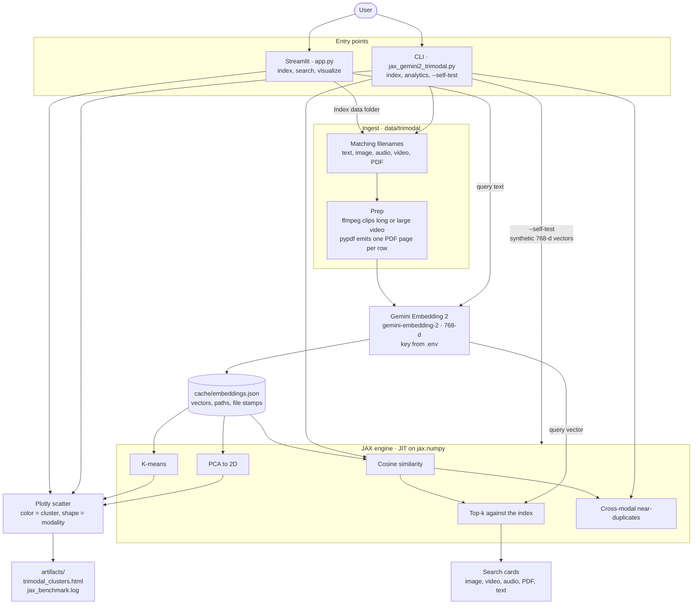

```mermaid
flowchart TB
  user([User])

  subgraph surfaces["Entry points"]
    ui["Streamlit · app.py<br/>index, search, visualize"]
    cli["CLI · jax_gemini2_trimodal.py<br/>index, analytics, --self-test"]
  end

  subgraph ingest["Ingest · data/trimodal"]
    files["Matching filenames<br/>text, image, audio, video, PDF"]
    split["Prep<br/>ffmpeg clips long or large video<br/>pypdf emits one PDF page per row"]
  end

  gemini["Gemini Embedding 2<br/>gemini-embedding-2 · 768-d<br/>key from .env"]
  cache[("cache/embeddings.json<br/>vectors, paths, file stamps")]

  subgraph jax["JAX engine · JIT on jax.numpy"]
    sim["Cosine similarity"]
    topk["Top-k against the index"]
    cluster["K-means"]
    pca["PCA to 2D"]
    dups["Cross-modal near-duplicates"]
  end

  cards["Search cards<br/>image, video, audio, PDF, text"]
  plot["Plotly scatter<br/>color = cluster, shape = modality"]
  artifacts["artifacts/<br/>trimodal_clusters.html<br/>jax_benchmark.log"]

  user --> ui
  user --> cli

  ui -->|"Index data folder"| files
  cli --> files
  files --> split --> gemini --> cache

  cache --> sim
  sim --> topk
  sim --> dups
  cache --> cluster --> plot
  cache --> pca --> plot

  ui -->|"query text"| gemini
  gemini -->|"query vector"| topk
  topk --> cards
  ui --> plot

  cli --> sim
  cli --> dups
  cli --> plot --> artifacts
  cli -->|"--self-test<br/>synthetic 768-d vectors"| jax
```
